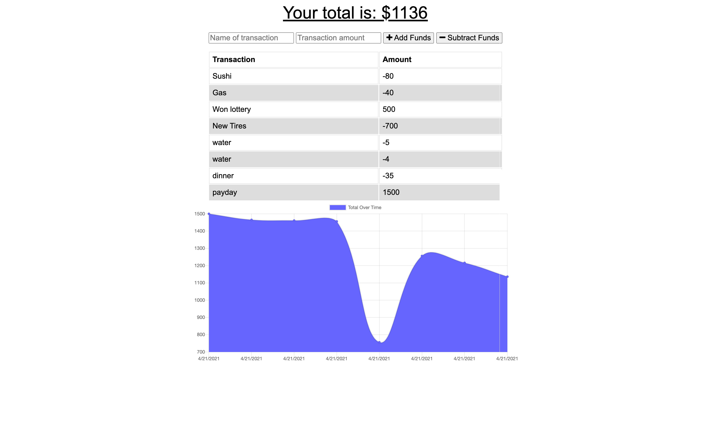

# Budget Tracker

## Table of Contents: 
- [Description](#description)
- [Installation](#installation)
- [Contributing](#contributing)
- [Tests](#tests)
- [License](#license)
- [Questions](#questions)

## Description: 
Internet isn't always reliable and sometimes you need to use applications while offline. You expect your data to be saved and uploaded to the server when you come back online. With the budget tracker, you can track expenses whether you are connected to the internet or not and your data will be safely stored on the server once you come online. 

Deployed Project: <a href="https://budget-tracker-offline-kd.herokuapp.com/">https://budget-tracker-offline-kd.herokuapp.com/</a>

Find the source code at <a href="https://github.com/koltondecker/budget-tracker">https://github.com/koltondecker/budget-tracker</a>.

<a href="https://www.npmjs.com/package/express">Express</a> was used for this project.

<a href="https://www.npmjs.com/package/mongoose">Mongoose</a> was used for this project.

<a href="https://www.npmjs.com/package/morgan">Morgan</a> was used for this project.

<a href="https://www.npmjs.com/package/lite-server">Lite-Server</a> was used for this project.

<a href="https://www.npmjs.com/package/compression">Compression</a> was used for this project.

### Application Homepage
 

## Installation: 
Upon downloading the files from this repo, use 'npm init' to initialize npm package and 'npm i' to install necessary dependencies for this project.

## Contributing: 
Feel free to contribute to this project in whatever ways you see beneficial. I will review pull requests and update with appropriate additions.

## Tests: 
No tests were used for this project.

### License: 
No license was used for this project. 

### Questions: 

If you would like to learn more, please take a look through my github below:

Visit my GitHub at <a href="https://github.com/koltondecker">github.com/koltondecker</a>

If you still have questions, please send me an email and I will respond as soon as I can:

<a href="mailto:deckerman25@gmail.com">deckerman25@gmail.com</a>
